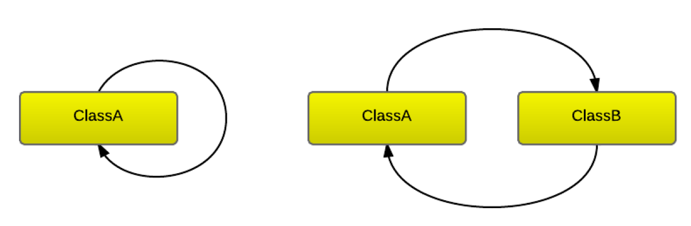
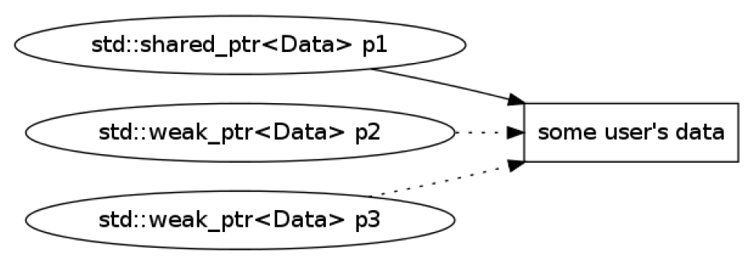

## Cyclic dependencies

* <!-- .element: class="fragment fade-in" --> Cyclic dependency is where you have class A with self-referencing member.
* <!-- .element: class="fragment fade-in" --> Cyclic dependency is where you have two classes A and B where A has a reference to B which has a reference to A.
* <!-- .element: class="fragment fade-in" --> How to fix it?



___

### `std::weak_ptr<>` to the rescue

<div style="width: 90%; margin: 0 auto">

Traits:

* <!-- .element: class="fragment fade-in" --> does not own an object
* <!-- .element: class="fragment fade-in" --> observes only
* <!-- .element: class="fragment fade-in" --> must be converted to <code>std::shared_ptr<></code> to access the object
* <!-- .element: class="fragment fade-in" --> can be created only from a <code>std::shared_ptr<></code>

</div>

<div>
    
</div>

___

### `std::weak_ptr<>` usage

<div class="multicolumn" style="position: relative">
<div class="col" style="font-size: 90%; width: 60%; flex: none">

```cpp
#include <memory>
#include <iostream>

struct Msg { int value; };

void checkMe(const std::weak_ptr<Msg> & wp) {
    auto p = wp.lock();
    if (p)
        std::cout << p->value << '\n';
    else
        std::cout << "Expired\n";
}

int main() {
    auto sp = std::shared_ptr<Msg>{new Msg{10}};
    auto wp = std::weak_ptr<Msg>{sp};
    checkMe(wp);
    sp.reset();
    checkMe(wp);
}
```

</div>

<div class="col" style="width: 30%">
    <div class="box" style="top: 35%; left: 75%">
        > ./a.out</br>
        10</br>
        Expired
    </div>
</div>
</div>

___

### `std::shared_ptr<>` cyclic dependencies

* How to solve this problem?

```cpp
#include <memory>

struct Node {
    std::shared_ptr<Node> child;
    std::shared_ptr<Node> parent;
};

int main () {
    auto root = std::shared_ptr<Node>(new Node);
    auto child = std::shared_ptr<Node>(new Node);
    root->child = child;
    child->parent = root;
}
```

___

### Breaking cycle - solution

* Use `std::weak_ptr<Node>` in one direction

```cpp
#include <memory>
struct Node {
    std::shared_ptr<Node> child;
    std::weak_ptr<Node> parent;
};

int main () {
    auto root = std::shared_ptr<Node>(new Node);
    auto child = std::shared_ptr<Node>(new Node);
    root->child = child;
    child->parent = root;
}
```

<div class="box" style="left: 20%;">
==148== All heap blocks were freed -- no leaks are possible
</div>
