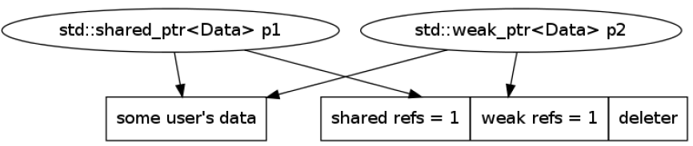

# Implementation details

    

        
    

___

### Implementation details – `std::unique_ptr<>`

* <!-- .element: class="fragment fade-in" --> Just a holding wrapper
* <!-- .element: class="fragment fade-in" --> Holds an object pointer
* <!-- .element: class="fragment fade-in" --> Constructor copies a pointer
* <!-- .element: class="fragment fade-in" --> Call proper delete in destructor
* <!-- .element: class="fragment fade-in" --> No copying
* <!-- .element: class="fragment fade-in" --> Moving means:
  * <!-- .element: class="fragment fade-in" --> Copying original pointer to a new object
  * <!-- .element: class="fragment fade-in" --> Setting source pointer to nullptr
* <!-- .element: class="fragment fade-in" --> All methods are inline

___

### Implementation details – `std::shared_ptr<>`

    <ul>
        <li>Holds an object pointer</li><!-- .element: class="fragment fade-in" --> 
        <li>Holds 2 reference counters:</li><!-- .element: class="fragment fade-in" --> 
        <ul>
            <li>shared pointers count</li><!-- .element: class="fragment fade-in" --> 
            <li>weak pointers count</li><!-- .element: class="fragment fade-in" --> 
        </ul>
    </ul>

    

* <!-- .element: class="fragment fade-in" --> Destructor:
  * <!-- .element: class="fragment fade-in" --> decrements <code>shared-refs</code>
  * <!-- .element: class="fragment fade-in" --> deletes user data when <code>shared-refs == 0</code>
  * <!-- .element: class="fragment fade-in" --> deletes reference counters when <code>shared-refs == 0</code> and <code>weak-refs == 0</code>
* <!-- .element: class="fragment fade-in" --> Extra space for a deleter
* <!-- .element: class="fragment fade-in" --> All methods are inline

___

### Implementation details – `std::shared_ptr<>`

* <!-- .element: class="fragment fade-in" style="margin-top: 20px" --> Copying means:
  * <!-- .element: class="fragment fade-in" --> Copying pointers to the target
  * <!-- .element: class="fragment fade-in" --> Incrementing <code>shared-refs</code>

* <!-- .element: class="fragment fade-in" style="margin-top: 60px" --> Moving means:
  * <!-- .element: class="fragment fade-in" --> Copying pointers to the target
  * <!-- .element: class="fragment fade-in" --> Setting source pointers to <code>nullptr</code>

___

### Implementation details – `std::weak_ptr<>`

* <!-- .element: class="fragment fade-in" --> Holds an object pointer
* <!-- .element: class="fragment fade-in" --> Holds 2 reference counters:
  * <!-- .element: class="fragment fade-in" --> shared pointers count
  * <!-- .element: class="fragment fade-in" --> weak pointers count

    

 

* <!-- .element: class="fragment fade-in" --> Destructor:
  * <!-- .element: class="fragment fade-in" --> decrements <code>weak-refs</code>
  * <!-- .element: class="fragment fade-in" --> deletes reference counters when <code>shared-refs == 0</code> and <code>weak-refs == 0</code>

___

### Implementation details – `std::weak_ptr<>`

* <!-- .element: class="fragment fade-in" style="margin-top: 20px" --> Copying means:
  * <!-- .element: class="fragment fade-in" --> Copying pointers to the target
  * <!-- .element: class="fragment fade-in" --> Incrementing <code>weak-refs</code>

* <!-- .element: class="fragment fade-in" style="margin-top: 60px" --> Moving means:
  * <!-- .element: class="fragment fade-in" --> Copying pointers to the target
  * <!-- .element: class="fragment fade-in" --> Setting source pointers to <code>nullptr</code>

___

### `std::weak_ptr<>` + `std::shared_ptr<>`

* <!-- .element: class="fragment fade-in" --> Having a shared pointer and a weak pointer

<!-- .element: class="fragment fade-in" -->

* <!-- .element: class="fragment fade-in" --> After removing the shared pointer

<!-- .element: class="fragment fade-in" -->

___

## Making a `std::shared_ptr<>`

* <!-- .element: class="fragment fade-in" --> <code>std::shared_ptr&ltData&gt p{new Data};</code>

<!-- .element: class="fragment fade-in" -->

* <!-- .element: class="fragment fade-in" --> <code>auto p = std::make_shared&ltData&gt();</code>
  * <!-- .element: class="fragment fade-in" --> Less memory (most likely)
  * <!-- .element: class="fragment fade-in" --> Only one allocation
  * <!-- .element: class="fragment fade-in" --> Cache-friendly

<!-- .element: class="fragment fade-in" -->