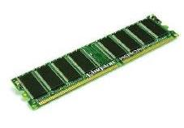

# Efficiency

<div class="multicolumn" style="height: 400px; position: relative;">
<div class="col">
    <div style="position: absolute; bottom: 0">
        
    </div>
</div>

<div class="col">
</div>

___

## Raw pointer

```cpp
#include <memory>
#include <vector>

struct Data {
    char tab_[42];
};

int main(void) {
    constexpr unsigned size = 10u * 1000u * 1000u;
    std::vector<Data *> v;
    v.reserve(size);
    for (unsigned i = 0; i < size; ++i) {
        auto p = new Data;
        v.push_back(std::move(p));
    }
    for (auto p: v)
        delete p;
}
```

___

## Unique pointer

```cpp
#include <memory>
#include <vector>

struct Data {
    char tab_[42];
};

int main(void) {
    constexpr unsigned size = 10u * 1000u * 1000u;
    std::vector<std::unique_ptr<Data>> v;
    v.reserve(size);
    for (unsigned i = 0; i < size; ++i) {
        std::unique_ptr<Data> p{new Data};
        v.push_back(std::move(p));
    }
}
```

___

## Shared pointer

```cpp
#include <memory>
#include <vector>

struct Data {
    char tab_[42];
};

int main(void) {
    constexpr unsigned size = 10u * 1000u * 1000u;
    std::vector<std::shared_ptr<Data>> v;
    v.reserve(size);
    for (unsigned i = 0; i < size; ++i) {
        std::shared_ptr<Data> p{new Data};
        v.push_back(std::move(p));
    }
}
```

___

## Shared pointer – `make_shared`

```cpp
#include <memory>
#include <vector>

struct Data {
    char tab_[42];
};

int main(void) {
    constexpr unsigned size = 10u * 1000u * 1000u;
    std::vector<std::shared_ptr<Data>> v;
    v.reserve(size);
    for (unsigned i = 0; i < size; ++i) {
        auto p = std::make_shared<Data>();
        v.push_back(std::move(p));
    }
}
```

___

## Weak pointer

```cpp
#include <memory>
#include <vector>

struct Data {
    char tab_[42];
};

int main(void) {
    constexpr unsigned size = 10u * 1000u * 1000u;
    std::vector<std::shared_ptr<Data>> vs;
    std::vector<std::weak_ptr<Data>> vw;
    vs.reserve(size);
    vw.reserve(size);
    for (unsigned i = 0; i < size; ++i) {
        std::shared_ptr<Data> p{new Data};
        std::weak_ptr<Data> w{p};
        vs.push_back(std::move(p));
        vw.push_back(std::move(w));
    }
}
```
<!-- .element: style="font-size: 50%" -->

___

## Measurements

<div class="multicolumn">
<div class="col" style="flex: none;width: 36%">

* <!-- .element: class="fragment fade-in" --> gcc-4.8.2
* <!-- .element: class="fragment fade-in" --> compilation with <code>–std=c++11 –O3 –DNDEBUG</code>
* <!-- .element: class="fragment fade-in" --> measuring with:
  * <!-- .element: class="fragment fade-in" --> time (real)
  * <!-- .element: class="fragment fade-in" --> htop (mem)
  * <!-- .element: class="fragment fade-in" --> valgrind (allocations count)

</div>
<div class="col" style="font-size: 70%">

| test name      | time [s] | allocations | memory [MB] |
|:--------------:|:--------:|:-----------:|:-----------:|
| raw pointer    | 0.54     | 10 000 001  | 686         |
| unique pointer | 0.56     | 10 000 001  | 686         |
| shared pointer | 1.00     | 20 000 001  | 1072        |
| make shared    | 0.76     | 10 000 001  | 914         |
| weak pointer   | 1.28     | 20 000 002  | 1222        |

</div>
</div>

___

## Conclusions

<div style="position: relative">

* <!-- .element: class="fragment fade-in" --> RAII
  * <!-- .element: class="fragment fade-in" --> acquire resource in constructor
  * <!-- .element: class="fragment fade-in" --> release resource in destructor
* <!-- .element: class="fragment fade-in" --> Rule of 5, Rule of 0
* <!-- .element: class="fragment fade-in" --> Smart pointers:
  * <!-- .element: class="fragment fade-in" --> <code>std::unique_ptr</code> – primary choice, no overhead, can convert to <code>std::shared_ptr</code>
  * <!-- .element: class="fragment fade-in" --> <code>std::shared_ptr</code> – introduces memory and runtime overhead
  * <!-- .element: class="fragment fade-in" --> <code>std::weak_ptr</code> – breaking cycles, can convert to/from <code>std::shared_ptr</code>
* <!-- .element: class="fragment fade-in" --> Create smart pointers with std::make_shared()</code> and <code>std::make_unique()</code>
* <!-- .element: class="fragment fade-in" --> Raw pointer should mean „access only” (no ownership)
* <!-- .element: class="fragment fade-in" --> Use reference instead of pointers if possible

<div style="position: absolute; top: 0; right: 0">
    
</div>

</div>

___

## Post-work

* <!-- .element: class="fragment fade-in" style="margin-top: 10px" --> Transform the list from <code>List.cpp</code> into double-linked list. You should implement:
  * <!-- .element: class="fragment fade-in" --> inserting Nodes at the beginning of the list
  * <!-- .element: class="fragment fade-in" --> searching elements in reverse
<!-- Changed from "searching elements from the backward" "searching elements in reverse" -->
  * <!-- .element: class="fragment fade-in" --> Apply proper smart pointers for the reverse direction.
* <!-- .element: class="fragment fade-in" style="margin-top: 10px" --> Implement your own <code>unique_ptr</code>. Requirements:
  * <!-- .element: class="fragment fade-in" --> Templatized (should hold a pointer to a template type)
  * <!-- .element: class="fragment fade-in" --> RAII (acquire in constructor, release in destructor)
  * <!-- .element: class="fragment fade-in" --> Copying not allowed
  * <!-- .element: class="fragment fade-in" --> Moving allowed
  * <!-- .element: class="fragment fade-in" --> Member functions: <code>operator*()</code>, <code>operator->()</code>, <code>get()</code>, <code>release()</code>, <code>reset()</code>
* <!-- .element: class="fragment fade-in" style="margin-top: 10px" --> Read one of these articles on move semantics:
  * <!-- .element: class="fragment fade-in" --> <a href="https://infotraining.bitbucket.io/cpp-11/move.html">Semantyka przenoszenia</a> (in Polish)
  * <!-- .element: class="fragment fade-in" --> <a href="https://www.cprogramming.com/c++11/rvalue-references-and-move-semantics-in-c++11.html">Move semantics and rvalue references in C++11</a> (in English)
