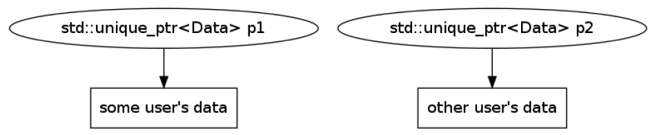

<h2>Smart pointers</h2>

<div class="multicolumn" style="height: 400px; position: relative;">
<div class="col">
    <div style="position: absolute; bottom: 0">
        
    </div>
</div>

<div class="col">
</div>

___

## Smart pointers

* <!-- .element: class="fragment fade-in" --> A smart pointer manages a pointer to a heap allocated object

  * <!-- .element: class="fragment fade-in" --> Deletes the pointed-to object at the right time
  * <!-- .element: class="fragment fade-in" --> <code>operator->()</code> calls managed object methods
  * <!-- .element: class="fragment fade-in" --> <code>operator.()</code> calls smart pointer methods
  * <!-- .element: class="fragment fade-in" --> smart pointer to a base class can hold a pointer to a derived class

* <!-- .element: class="fragment fade-in" --> STL smart pointers:

  * <!-- .element: class="fragment fade-in" --> <code>std::unique_ptr<></code>
  * <!-- .element: class="fragment fade-in" --> <code>std::shared_ptr<></code>
  * <!-- .element: class="fragment fade-in" --> <code>std::weak_ptr<></code>
  * <!-- .element: class="fragment fade-in" --> <code>std::auto_ptr<></code> - removed in C++17

___

### `std::unique_ptr<>`

<div style="width: 70%; margin: 0 auto">

Traits:

* <!-- .element: class="fragment fade-in" --> one object == one owner
* <!-- .element: class="fragment fade-in" --> destructor destroys the object
* <!-- .element: class="fragment fade-in" --> copying not allowed
* <!-- .element: class="fragment fade-in" --> moving allowed
* <!-- .element: class="fragment fade-in" --> can use custom deleter

</div>



___

### `std::unique_ptr<>` usage

* Old style approach vs modern approach

<div class="multicolumn" style="font-size: 90%">
<div class="col">

```cpp
#include <iostream> // old-style approach


struct Msg {
    int getValue() { return 42; }
};

Msg* createMsg() {
    return new Msg{};
}

int main() {
    auto msg = createMsg();

    std::cout << msg->getValue();
    delete msg;
}
```

</div>

<div class="col">

```cpp
#include <memory> // modern approach
#include <iostream>

struct Msg {
    int getValue() { return 42; }
};

std::unique_ptr<Msg> createMsg() {
    return std::unique_ptr<Msg>(new Msg{});
}

int main() {
    // unique ownership
    auto msg = createMsg();

    std::cout << msg->getValue();
}
```

</div>

___

### `std::unique_ptr<>` usage

* Copying is not allowed, moving is allowed

<div class="multicolumn" style="font-size: 90%">
<div class="col">

```cpp
std::unique_ptr<MyData> source(void);
void sink(std::unique_ptr<MyData> ptr);

void simpleUsage() {
    source();
    sink(source());
    auto ptr = source();
    // sink(ptr); ERROR
    sink(std::move(ptr));
    auto p1 = source();
    //auto p2 = p1; ERROR
    auto p2 = std::move(p1);
    //p1 = p2; ERROR
    p1 = std::move(p2);
}

```

</div>

<div class="col">

```cpp
std::unique_ptr<MyData> source(void);
void sink(std::unique_ptr<MyData> ptr);

void collections()
{
    std::vector<std::unique_ptr<MyData>> v;
    v.push_back(source());
    auto tmp = source();

    //v.push_back(tmp); ERROR
    v.push_back(std::move(tmp));

    //sink(v[0]); ERROR
    sink(std::move(v[0]));
}
```

</div>

___

##### `std::unique_ptr<>` cooperation with raw pointers

* <!-- .element: class="fragment fade-in" --> <code>get()</code> – returns a raw pointer without releasing the ownership
* <!-- .element: class="fragment fade-in" --> <code>release()</code> – returns a raw pointer and release the ownership
* <!-- .element: class="fragment fade-in" --> <code>reset()</code> – replaces the manager object
* <!-- .element: class="fragment fade-in" --> <code>operator*()</code> – dereferences pointer to the managed object

<div style="font-size: 90%; width: 80%; margin: 0 auto">

```cpp
#include <memory>

void legacyInterface(int*) {}
void deleteResource(int* p) { delete p; }
void referenceInterface(int&) {}

int main() {
    auto ptr = std::make_unique<int>(5);
    legacyInterface(ptr.get());
    deleteResource(ptr.release());
    ptr.reset(new int{10});
    referenceInterface(*ptr);
    ptr.reset(); // ptr is a nullptr
    return 0;
}
```

</div>

___

### `std::make_unique()`

`std::make_unique()` is a factory function that produce `unique_ptrs`

* <!-- .element: class="fragment fade-in" --> added in C++14 for symmetrical operations on unique and shared pointers
* <!-- .element: class="fragment fade-in" --> avoids bare <code>new</code> expression

<div style="font-size: 100%; width: 80%; margin: 0 auto">

```cpp
#include <memory>

struct Msg {
    Msg(int i) : value(i) {}
    int value;
};

int main() {
    auto ptr1 = std::unique_ptr<Msg>(new Msg{5});
    auto ptr2 = std::make_unique<Msg>(5);
    return 0;
}
```

</div>

___

### `std::unique_ptr<T[]>`

* <!-- .element: class="fragment fade-in" --> During destruction
  * <!-- .element: class="fragment fade-in" --> <code>std::unique_ptr&ltT&gt</code> calls <code>delete</code>
  * <!-- .element: class="fragment fade-in" --> <code>std::unique_ptr&ltT[]&gt</code> calls <code>delete[]</code>
* <!-- .element: class="fragment fade-in" --> <code>std::unique_ptr&ltT[]&gt</code> has additional <code>operator[]</code> for accessing array element
* <!-- .element: class="fragment fade-in" --> Usually <code>std::vector&ltT&gt</code> is a better choice

<div style="font-size: 100%; width: 80%; margin: 0 auto">

```cpp
struct MyData {};

void processPointer(MyData* md) {}
void processElement(MyData md) {}

using Array = std::unique_ptr<MyData[]>;

void use(void)
{
    Array tab{new MyData[42]};
    processPointer(tab.get());
    processElement(tab[13]);
}
```

</div>

___

## Exercise: ResourceD

1. <!-- .element: class="fragment fade-in" --> Compile and run ResourceD application and check memory leaks under valgrind
2. <!-- .element: class="fragment fade-in" --> Fix memory leaks with a proper usage of <code>delete</code> operator
3. <!-- .element: class="fragment fade-in" --> Refactor the solution to use <code>std::unique_ptr<></code>
4. <!-- .element: class="fragment fade-in" --> Use <code>std::make_unique()</code>